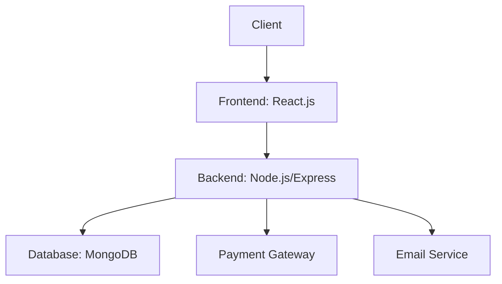
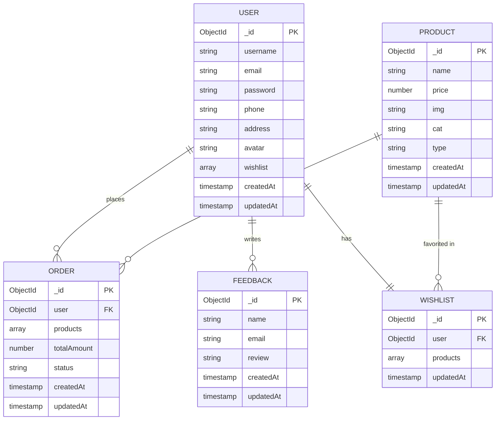

<!-- Cover Page -->

# 🛒 CozaStore

### E-commerce Website

##### Team[14]

---

<br><br><br><br><br><br>

| 👤 Team member                       | 🆔 ID          | 📚 Section |
| ------------------------------------ | -------------- | ---------- |
| **فرحة أحمد علي زكي**                | **2022170307** | **4**   |
| **فجر أشرف اسماعيل عبدالمنعم**       | **2022170305** | **4**   |
| **كنزي عادل صلاح محمد**              | **2022170316** | **4**   |
| **الشيماء أحمد محمد علي**            | **2022170071** | **1**  |
| **بانسيه عبدالناصر محمود ابوالفتوح** | **2022170090** | **1**   |
| **أمنية محمود أحمد محمد**            | **2022170075** | **1**   |

<div style="page-break-after: always;"></div>

## 📄 Project Overview:

### 🛒 Introduction

**CozaStore** is a modern **online shopping platform** designed to provide users with an efficient e-commerce experience. The platform enables customers to browse, filter, and purchase products while offering additional features such as wishlists, order history tracking, and customer support.

### 🎯 Objectives

* Deliver a **user-friendly shopping experience** with intuitive navigation.
* Provide **advanced product filtering** (by category and type).
* Allow users to **save items for later** via a wishlist feature.
* Ensure a **secure and smooth checkout process**.
* Maintain **order history** for user convenience.
* Offer **accessible customer support** through feedback system.

### 📌 Scope

This project focuses on implementing the core functionalities required for an online shopping experience, including:

* **User Management**: Registration, login, password encryption, and profile management.
* **Product Catalog**: Displaying product details with images, categories, and types.
* **Shopping Experience**:
  * Filtering products by category/type
  * Adding items to wishlist
  * Placing orders with quantity selection
* **Order Tracking**: Storing and retrieving order history per user.
* **Feedback System**: Collecting user reviews and feedback.

<!-- Improved entities section to match actual DB schemas -->
### 🧩 Entities and Their Roles

#### 👤 User

* **Description**: Represents an individual registered on the platform.
* **Attributes**:
  * `username`: Unique identifier (required, trimmed)
  * `email`: Valid and unique email (required, validated)
  * `password`: Encrypted (min 8 chars, required)
  * `phone`: Optional contact number
  * `address`: Optional shipping address
  * `avatar`: Optional profile image
  * `wishlist`: Array of product references
* **Security Features**:
  * Passwords encrypted using **`bcrypt`** (salt + hash)
  * Static login method for authentication
* **Role in the System**:
  * Places orders and manages personal data
  * Maintains wishlist of favorite products
  * Submits feedback

#### 📦 Product

* **Description**: Represents an item available for sale.
* **Attributes**:
  * `name`: Product title (required)
  * `price`: Numeric value (required)
  * `img`: Image URL (required)
  * `cat`: Category (required)
  * `type`: Classification (required)
* **Role in the System**:
  * Displayed in product listings
  * Referenced in orders and wishlists
  * Categorized for filtering

#### 🧾 Order

* **Description**: Records customer purchase transactions.
* **Attributes**:
  * `user`: Reference to ordering user (required)
  * `products`: Array with:
    * `product`: Reference to Product
    * `quantity`: Number of items (default: 1)
    * `purchasedAtPrice`: Snapshot of price at time of purchase
  * `totalAmount`: Calculated order total (required)
  * `status`: Enum (pending/completed/cancelled)
* **Role in the System**:
  * Tracks purchase history
  * Maintains order state
  * Records transactional data

#### 💬 Feedback

* **Description**: Stores customer reviews and inquiries.
* **Attributes**:
  * `name`: Reviewer's name (required, max 50 chars)
  * `email`: Valid email (required)
  * `review`: Feedback content (10-500 chars)
* **Role in System**:
  * Collects user opinions
  * Provides customer support channel

#### ❤️ Wishlist

* **Description**: Tracks user's favorite products.
* **Attributes**:
  * `user`: Reference to User (required, unique)
  * `products`: Array of Product references
* **Role in System**:
  * Saves products for later viewing
  * Personalizes user experience

---

## Functional Requirements:

### 1. 👤 User Authentication & Management:

#### 1.1 🧑‍💼 User Registration

* **Description**: Allows new users to create an account.
* **Pre-condition**:
  * User provides unique username, valid email, and password (8+ chars).
* **Post-condition**:
  * Account created with encrypted password.
  * Default empty wishlist initialized.

#### 1.2 🔐 User Login

* **Description**: Authenticates users via email/password.
* **Pre-condition**:
  * Valid credentials provided.
* **Post-condition**:
  * User authenticated via bcrypt comparison.
  * Session established.

### 2. 🛒 Product Browsing & Interaction

#### 2.1 🛍️ Browse and Filter Products

* **Description**: View products filtered by category/type.
* **Pre-condition**:
  * User accesses product listings.
* **Post-condition**:
  * Filtered products displayed.

#### 2.2 ❤️ Wishlist Management

* **Description**: Add/remove products from wishlist.
* **Pre-condition**:
  * User is authenticated.
  * Product exists.
* **Post-condition**:
  * Wishlist document updated.

### 3. 🧾 Order Management

#### 3.1 💳 Place Order

* **Description**: Convert cart items to order.
* **Pre-condition**:
  * User authenticated.
  * Products selected.
* **Post-condition**:
  * Order created with:
    * Product snapshots
    * Calculated total
    * Pending status

#### 3.2 📜 View Order History

* **Description**: Display user's past orders.
* **Pre-condition**:
  * User authenticated.
* **Post-condition**:
  * Orders populated with product details.

### 4. 📞 Customer Support

#### 4.1 📝 Submit Feedback

* **Description**: Collect user reviews.
* **Pre-condition**:
  * Form with valid data submitted.
* **Post-condition**:
  * Feedback document created.

---

# 📄 Technical Requirements

## 1. 🏗️ Architecture & Components

### 1.1 System Architecture


---

### 1.2 Key Components

|Component| Technology | Responsibility|
|---------|------------|---------------|
|**Frontend**| `React`, `HTML/CSS`, `JavaScript`.| It provides UI rendering, filtering, cart/wishlist management.|
|**Backend**| `Node.js` with `Express.js`.| It contains API logic, sessions, and authentication.|
|**Database**| `MongoDB` (accessed via `Mongoose`).| It Store users, products, orders.|
|**Authentication**| `Bcrypt`| password hashing and session/token-based authentication.|

---

## 2. 💾 Infrastructure Requirements

### 2.1 Server Setup

|Item|Details|
|----|--------|
|**Web Server**|	`Node.js` + `Express`|
|**Database**|	`MongoDB`|
|**Authentication**|	`bcrypt` + `sessions or JWT`|


### 2.2 Environment Variables

|Item|Details|
|----|--------|
|`MONGODB_URI`| MongoDB connection string.|
|`JWT_SECRET`| Token signing key.|
|`SESSION_SECRET`| For session handling.|
|`PORT`| Server port.|

### 2.3 Third-Party Services

|Item|Details|
|----|--------|
|**Email**| SendGrid / Nodemailer with SMTP.|
|**Payment Gateway**| Stripe / PayPal.|

---

## 3. 🔧 Development Tools & Libraries

|Category |Tool |Purpose |
|---------|-----|--------|
|**Language**|	JavaScript|	Main language|
|**Runtime**|	Node.js|	Server-side runtime|
|**Framework**|	Express|	REST API|
|**DB**|	MongoDB + Mongoose|	NoSQL + modeling|
|**Auth**|	bcryptjs|	Password hashing|
|**Frontend**|	React| UI rendering|
|**VCS**|	Git + GitHub|	Version control|
|**Diagramming**|	Mermaid|	Visual diagrams|

---

## 📦 Database Schema



---

### 🧑‍💼 Users Collection

| Field    | Type       | Constraints      |Description    |                  
|----------|------------|------------------|---------------|
| `_id`    | ObjectId   | Auto-generated   | Unique user identifier  |
| `username`| String    | **Required**, Unique, Trimmed     | User's unique handle     |
| `email`  | String     | **Required**, Unique, Validated with regex and isEmail, Lowercase | User's email address|
| `password`| String    | **Required**, Minlength: 8, Hashed with bcrypt, `select: false` by default | Securely hashed password|
| `phone`  | String     | Optional, Trimmed | Contact number |
| `address`| String     | Optional, Trimmed | Shipping address|
| `avatar` | String     | Optional, Trimmed | Profile image URL|
| `wishlist`| ObjectId[]| References Product model| Array of favorite products|
| `createdAt`| Date     | Auto-generated    | Timestamp of account creation|
| `updatedAt`| Date     | Auto-generated    | Timestamp of last update     |

🔐 Passwords are hashed using bcryptjs before saving to the database

---

### 🛍️ Products Collection

| Field       | Type     | Constraints               | Description                             |
|-------------|----------|---------------------------|-----------------------------------------|
| `_id`       | ObjectId | Auto-generated            | Unique product identifier               |
| `name`      | String   | **Required**              | Product name                            |
| `price`     | Number   | **Required**              | Current price in local currency         |
| `img`       | String   | **Required**              | URL to product image                    |
| `cat`       | String   | **Required**              | Main category (e.g. "Electronics")      |
| `type`      | String   | **Required**              | Sub-category (e.g. "Smartphones")       |
| `createdAt` | Date     | Auto-generated            | Timestamp of product creation           |
| `updatedAt` | Date     | Auto-generated            | Timestamp of last update                |

---

### 📦 Orders Collection

| Field       | Type       | Constraints   | Description   |
|-------------|------------|---------------|---------------|
| `_id`       | ObjectId   | Auto-generated| Unique order identifier|
| `user`      | ObjectId   | **Required**, References User model| User who placed the order |
| `products`  | Array      | **Required**  | Contains: `product` , `quantity`, `purchasedAtPrice`|
| `totalAmount`| Number    | **Required**  | Calculated sum of all products in order|
| `status`    | String     | Enum: ['pending','completed','cancelled']    | Current order status (Default: 'pending')|
| `createdAt` | Date       | Auto-generated                               | Timestamp of order creation|
| `updatedAt` | Date       | Auto-generated                               | Timestamp of last update|

---

### Feedback Collection

| Field       | Type     | Constraints                                       | Description                         |
|-------------|----------|---------------------------------------------------|-------------------------------------|
| `_id`       | ObjectId | Auto-generated                                    | Unique feedback identifier          |
| `name`      | String   | **Required**, Trimmed, Maxlength: 50              | Reviewer's name                     |
| `email`     | String   | **Required**, Valid email format                  | Reviewer's contact email            |
| `review`    | String   | **Required**, Trimmed, Minlength:10, Maxlength:500| Feedback content                    |
| `createdAt` | Date     | Auto-generated                                    | Timestamp of submission             |
| `updatedAt` | Date     | Auto-generated                                    | Timestamp of last update            |

---

### Wishlist Collection

| Field       | Type       | Constraints                          | Description                         |
|-------------|------------|--------------------------------------|-------------------------------------|
| `_id`       | ObjectId   | Auto-generated                       | Unique wishlist identifier          |
| `user`      | ObjectId   | **Required**, Unique, References User| Associated user                     |
| `products`  | ObjectId[] | References Product model             | Array of favorite products         |
| `updatedAt` | Date       | Auto-generated                       | Timestamp of last modification      |

---

### 🔄 Relationships & Constraints

#### One-to-Many
- **User → Orders**  
  A single user can place multiple orders  
  `user: { type: ObjectId, ref: 'User', required: true }`

- **User → Feedback**  
  A user can submit multiple feedback entries

#### One-to-One 
- **User ↔ Wishlist**  
  Each user has exactly one wishlist  
  Enforced by: `user: { ..., unique: true }`

#### Many-to-Many
- **Wishlist ↔ Products**  
  Wishlists contain multiple products  
  Products appear in many wishlists  
  ```javascript
  products: [{
    type: mongoose.Schema.Types.ObjectId,
    ref: 'Product', 
    required: true
  }]
  ```

