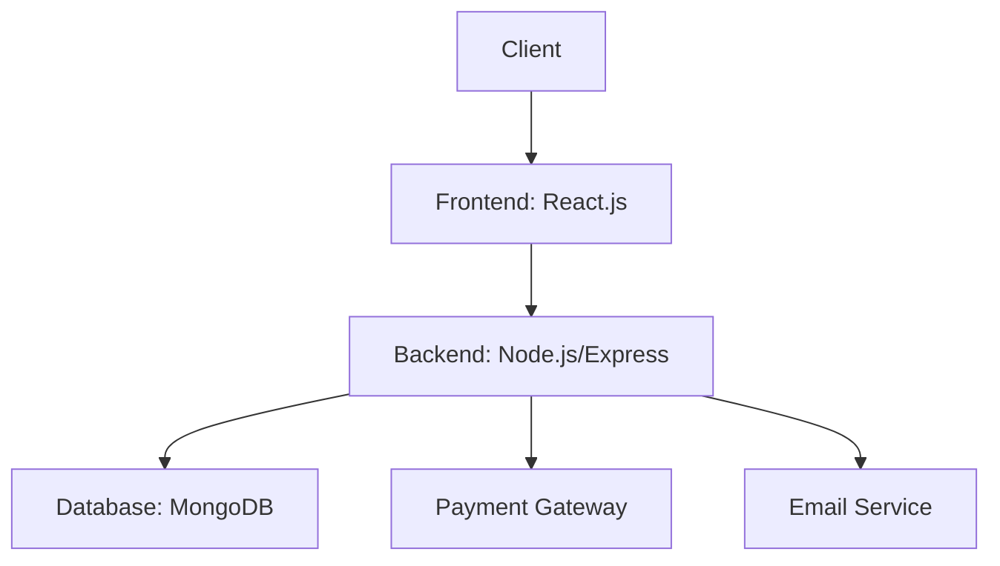
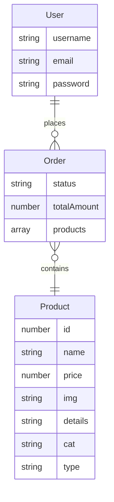
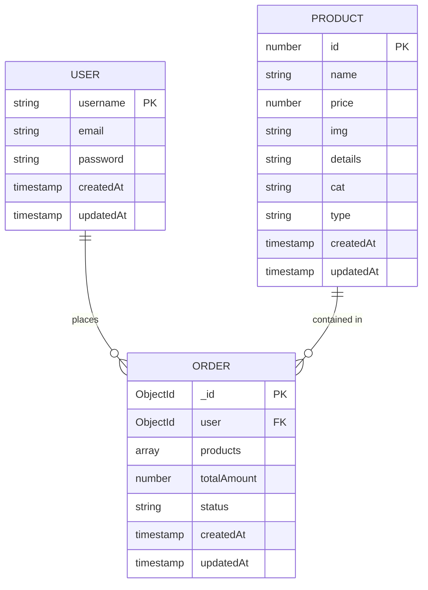

<!-- Cover Page -->
#  🛒 CozaStore
###  E-commerce Website
#####  Team[14]

---

      

|👤 Team member|🆔 ID|📚 Section|
|-----------|--|-------|
|**فرحة أحمد علي زكي**|**2022170307**|****|
|**فجر أشرف اسماعيل عبدالمنعم**|**2022170305**|****|
|**كنزي عادل صلاح محمد**|**2022170316**|****|
|**الشيماء أحمد محمد علي**|**2022170071**|****|
|**بانسيه عبدالناصر محمود ابوالفتوح**|**2022170090**|****|
|**أمنية محمود أحمد محمد**|**2022170075**|****|

## 📄 Project Overview: 

### 🛒 Introduction

**CozaStore** is a modern **online shopping platform** designed to provide users with an efficient e-commerce experience. The platform enables customers to browse, filter, and purchase products while offering additional features such as wishlists, order history tracking, and customer support.

### 🎯 Objectives

- Deliver a **user-friendly shopping experience** with intuitive navigation. 
  
- Provide **advanced product filtering** (Trending, New, Featured, Top-Selling).  
  
- Allow users to **save items for later** via a wishlist feature. 
   
- Ensure a **secure and smooth checkout process**.  
  
- Maintain **order history** for user convenience.  
  
- Offer **accessible customer support** through a dedicated Contact page.  

### 📌 Scope

This project focuses on implementing the core functionalities required for an online shopping experience, including:

- **User Management**: Registration, login, password encryption, and session handling.
- **Product Catalog**: Displaying product details, categories, and types with images.
- **Shopping Experience**:
  - Filtering products *(Trending, New, Featured, Top-Selling)* and browse them.
  - Adding items to cart or wishlist.
  - Placing orders and handling payments.
- **Order Tracking**: Storing and retrieving order history per user.
- **Support & Info Pages**: Contact page for user inquiries and About page for platform info.

### 🧩 Entities and Their Roles

#### 👤 User

- **Description**: Represents an individual registered on the platform.
- **Attributes**:
  - `Username`: Unique name of the user (required).
  - `E-mail`: Must be a valid, unique email address (required).
  - `Password`: Encrypted password (minimum 8 characters, required).
- **Other Features**:
  - Passwords are encrypted using **`bcrypt`** before being saved.
  - Includes a method to compare plaintext and hashed passwords.
- **Role in the System**:
  - Registers and logs in to the system.
  - Can place orders, add product to wishlist, view orders history, and manage personal account data.

---

#### 📦 Product

- **Description**: Represents an item available for sale in the store.
- **Attributes**:
  - `ID` , `Name`, `Price`, `Image`, `Details` , `Category` ,`Type`
- **Role in the System**:
  - Displayed to users during browsing and checkout.
  - Referenced in order records and user interactions (wishlist/cart).

---

#### 🧾 Order

- **Description**: Represents a customer's purchase transaction.
- **Attributes**:
  - `User`: Reference to the `User` who placed the order (required).
  - `Products`: List of all items included in the order. Each item includes these attributes:
    - `Product`
    - `Quantity`: Default is 1.
    - `Purchased-At-Price`
  - `Total-Amount`: Sum total of all products in the order (required).
  - `Status`: Current state of the order (`pending`, `completed`, or `cancelled`), default is `pending`.
- **Role in the System**:
  - Stores a record of user purchases.
  - Facilitates order tracking and management through the user profile.

---

## Functional Requirements:

### 1. 👤 User Authentication & Management:

#### 1.1 🧑‍💼 User Registration

- **Description**: Allows new users to create an account.
- **Pre-condition**:
  - The user is not logged in.
  - The user provides a unique username, valid email, and password.
- **Post-condition**:
  - A new user account is created.
  - Password is securely hashed using **`bcrypt`**.

---

#### 1.2 🔐 User Login

- **Description**: Authenticates a user using email and password.
- **Pre-condition**:
  - The user has an existing account.
  - The provided credentials are valid.
- **Post-condition**:
  - User is authenticated.
  - A session or authentication token is created.

---

### 2. 🛒 Product Browsing & Interaction

#### 2.1 🛍️ Browse and Filter Products

- **Description**: Users can view and filter products by category, or tags (Trending, New, Featured, Top-Selling).
- **Pre-condition**:
  - User navigates the home page or shop page then select the filer.
- **Post-condition**:
  - Products matching the selected filters are displayed.

---

#### 2.2 🧺 Add Product to Cart/Wishlist

- **Description**: Users can add selected products to their shopping cart or wishlist.
- **Pre-condition**:
  - User is logged in.
  - User is viewing a product.
  - User press on the **heart icon** in the product view to add it to the wishing-list or press on the **add to cart** button.
- **Post-condition**:
  - Product is added to the wishlist or to cart.

---

### 3. 🧾 Order Management

#### 3.1 💳 Place an Order

- **Description**: Users can purchase products in their cart.
- **Pre-condition**:
  - User is logged in.
  - Cart contains products.
  - Payment information is provided.
- **Post-condition**:
  - An order is created.
  - Total amount is calculated and saved.
  - Order status is set to `pending`.

---

#### 3.2 🧾 View Order History

- **Description**: Users can view a list of all their past orders.
- **Pre-condition**:
  - User is logged in.
  - User navigates the **profile** page then select the **order history** filter.
- **Post-condition**:
  - List of user's orders is retrieved and displayed.

---

### 4. 📞 Customer Support

#### 4.1 📬 Contact Support

- **Description**: Users can submit inquiries or issues via a contact form.
- **Pre-condition**:
  - User fills in the contact form with valid data.
- **Post-condition**:
  - Support request is submitted to the admin/support team.

---

# 📄 Technical Requirements

## 1. 🏗️ Architecture & Components

### 1.1 System Architecture

### 1.2 Key Components

|Component| Technology | Responsibility|
|---------|------------|---------------|
|**Frontend**| `React`, `HTML/CSS`, `JavaScript` (interacts with backend via `API`).| It provides UI rendering, filtering, cart/wishlist management.|
|**Backend**| `Node.js` with `Express.js`.| It contains API logic, sessions, and authentication.|
|**Database**| `MongoDB` (accessed via `Mongoose`).| It Store users, products, orders.|
|**Authentication**| `Bcrypt`| password hashing and session/token-based authentication.|

## 2. 💾 Infrastructure Requirements

### 2.1 Server Setup
|Item|Details|
|----|--------|
|**Web Server**|	Node.js + Express|
|**Database**|	MongoDB|
|**Authentication**|	bcrypt + sessions or JWT|
|**Config**|	.env for DB URI, secret keys|

### 2.2 Environment Variables

|Item|Details|
|----|--------|
|`MONGODB_URI`| MongoDB connection string.|
|`JWT_SECRET`| Secret key for token generation (if JWT used).|
|`SESSION_SECRET`| For session handling (if using sessions).|
|`PORT`| Server port.|

### 2.3 Third-Party Services

|Item|Details|
|----|--------|
|**Email**| SendGrid / Nodemailer with SMTP.|
|**Payment Gateway**| Stripe / PayPal.|

---

## 3. 🔧 Development Tools & Libraries

|Category |Tool |Purpose |
|---------|-----|--------|
|**Language**|	JavaScript|	Main language|
|**Runtime**|	Node.js|	Server-side runtime|
|**Framework**|	Express|	REST API|
|**DB**|	MongoDB + Mongoose|	NoSQL + modeling|
|**Auth**|	bcryptjs|	Password hashing|
|**Environment**|	dotenv|	Env variables|
|**Frontend**|	React| UI rendering|
|**VCS**|	Git + GitHub|	Version control|
|**Diagramming**|	Mermaid|	Visual diagrams|

---

## 4. 🧩 Entity Relationship Overview

---

## 📦 Database Schema

---
### 🧑‍💼 Users Collection

|Field |Type |Constraints |Description |
|------|-----|------------|------------|
|**Username** |String |Required, Unique, Trimmed |Unique username for the user |
|**Email** |String |Required, Unique, Valid email format |User's email address |
|**Password** |String |Required, Minlength: 8, Hashed | Encrypted user password |
|**CreatedAt** |Date   |Auto-generated |Timestamp of creation |
|**UpdatedAt** |Date   |Auto-generated |Timestamp of last update |

🔐 Passwords are hashed using bcryptjs before saving to the database

---

### 🛍️ Products Collection

| Field | Type | Constraints | Description |
|-------|------|-------------|-------------|
| **Id** | Number | Required, Unique | Product identifier |
| **Name** | String | Required | Product name |
| **Price** | Number | Required | Price of the product |
| **Img** | String | Required | URL of the product image |
| **Details** | String | Required | Description/details of the product |
| **Cat** | String | Required | Category of the product |
| **Type** | String | Required | Type/variant of the product |
| **CreatedAt** | Date | Auto-generated | Timestamp of creation |
| **UpdatedAt** | Date | Auto-generated | Timestamp of last update |

---

### 📦 Orders Collection

| Field | Type | Constraints | Description |
|-------|------|-------------|-------------|
| **User** | ObjectId | Required, Ref: User | ID of the user who placed the order |
| **Products** | Array | Contains: product ref, quantity, purchased price | List of ordered items with details |
| **TotalAmount** | Number | Required | Total price for the entire order |
| **Status** | String | Enum: pending, completed, cancelled | Current status of the order |
| **CreatedAt** | Date | Auto-generated | Timestamp of order creation |
| **UpdatedAt** | Date | Auto-generated | Timestamp of last order update |

---

### 🔄 Relationships & Constraints

- **One-to-Many**: A User can place many Orders.

- **Many-to-One**: Each Order references a single User.

- **Many-to-Many (via embedded array)**: An Order can contain multiple Products, and each product can appear in multiple orders.

